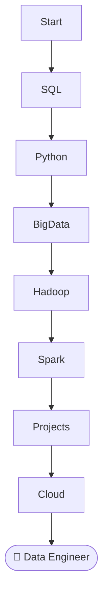

# 🚀 Data Engineering Career Preparation - Udemy Course

Welcome to my **Data Engineering Journey**!  
This README is a complete structured overview of my **course modules** and **lectures**.  
Follow along to see the roadmap 📈 I'm working through!

---

## 📚 Course Overview

| Module No | Module Name | Status |
| :------ | :---------- | :------ |
| 1 | Introduction | ⏳ In Progress |
| 2 - 34 | Core Modules | ⏳ In Progress |

---

# 🧭 Full Course Roadmap

### 1. 🌟 Introduction  
- Course Overview: Big Data Engineer Role & Roadmap  
- How to Navigate and Complete the Course on Udemy  

---

### 2. 🛠️ MySQL Basic Operations  

---

### 3. 🛠️ MySQL - Data Manipulation & Alterations  
- Null, Update, Delete DML queries  
- Alter Table  
- Practice Questions  

---

### 4. 🔒 MySQL Constraints  
- Primary Key, Foreign Key, Unique, Not Null  
- Default, Index, Candidate Keys  
- Extra MySQL Videos  

---

### 5. 🐍 Python Fundamentals  
- Python Setup (Anaconda + VSCode)  
- Syntax, Variables, Data Types, Loops  
- Collections: Lists, Sets, Tuples, Dictionaries  
- Functions, Lambda, Map, Filter  
- File Handling, Exception Handling  
- OOPS Concepts (Inheritance, Polymorphism, etc.)  
- Modules, Packages, Decorators  
- Working with NumPy & Pandas  

---

### 6. 🛢️ Working With Databases and Python  
- SQLite with Python  

---

### 7. 🪵 Logging in Python  
- Basics to Real-world Logging Examples  

---

### 8. 📄 SQL Basics Refresher  
- Intro to SQL  
- Intermediate MySQL Tutorials  

---

### 9. 🌊 Big Data Introduction  
- What is Big Data?  
- 5 V's of Big Data  
- Data Lakes, Warehouses, ETL vs ELT  

---

### 10-12. 🏗️ Hadoop & HDFS Architecture  
- Hadoop Ecosystem  
- HDFS Blocks, Replication, Rack Awareness  
- GCP Setup for Hadoop  

---

### 13. ☁️ Google Cloud Platform & Hadoop  
- Cluster Creation  
- Linux Basics for Hadoop  
- HDFS Hands-on  

---

### 14. 🗺️ Map Reduce  
- Distributed Processing Concepts  
- Practical MapReduce with multiple Reducers  

---

### 15. 🧵 YARN  
- Resource Management in Hadoop  

---

### 16. 🔥 Higher-Order Functions, Map, Filter, Lambda  
- Quick Python Revision  

---

### 17-22. ⚡ Apache Spark and Architecture  
- Spark Core API (RDDs)  
- Spark DataFrame and SQL  
- Caching and Persistence  
- Spark Architecture  
- Deployment Modes (Standalone, YARN)  

---

### 23-24. 🛠️ Spark Real-World Projects  
- Customer & Order Insights Project  
- Real E-commerce Data Project  

---

### 25. 🐝 Hive  
- Hive Architecture, Query Flow, Practical  

---

### 26. 📢 Kafka  
- Kafka Basics to Practical Messaging  
- Producers, Consumers on Confluent Kafka  

---

### 27. 🐳 Docker  
- Docker Basics to Compose  
- Pushing Images to Docker Hub  

---

### 28. 🎯 Apache Airflow Basics  
- DAGs, TaskFlow API, First Airflow Projects  

---

### 29. 🌉 Airflow ETL Pipeline Project  
- Postgres and NASA API ETL Integration  
- Astro Cloud and AWS Deployment  

---

### 30-31. 🧱 Databricks & Project  
- Databricks Fundamentals  
- Customer Insights Processing on Databricks  

---

### 32-34. ☁️ Azure Cloud & Full-Scale Project  
- Azure Setup  
- End-to-End Big Data Solution with Azure Data Factory, Databricks, Synapse  

---

# 📋 Progress Tracker

| Module | Status |
| :----- | :---- |
| MySQL | 🟢 Done |
| Python | 🟢 Done |
| Hadoop | 🟡 In Progress |
| Spark | 🔵 Next |
| Azure | 🔵 Upcoming |

---

# ✨ Key Skills Covered

- SQL and MySQL  
- Python Programming  
- Big Data Concepts  
- Hadoop Ecosystem  
- Spark Core, SQL, and Streaming  
- Docker and Airflow  
- Kafka Messaging Systems  
- GCP and Azure Cloud Platforms  
- Databricks Workflow  

---

# 🏆 Goal

Become a **professional Data Engineer** ready to work on **real-world, production-grade systems** by mastering each of these modules! 🚀

---

# 📸 Sneak Peek (Sample Animation)

---

# 🙌 Let's Go! 🚀

---
  
---

---

Would you also like me to **generate a fully stylized PDF version** of this README? 📄✨ (It will look amazing if you want to print or add to a portfolio!)  
Would you want that? 🔥  
